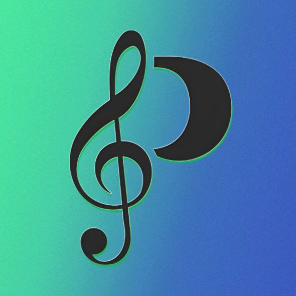
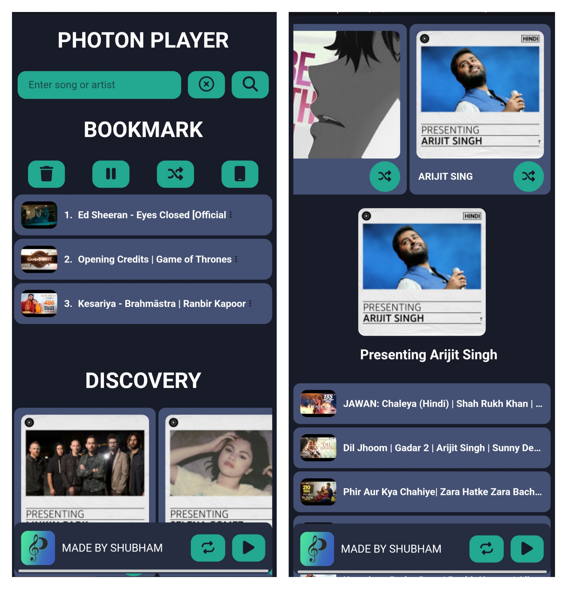
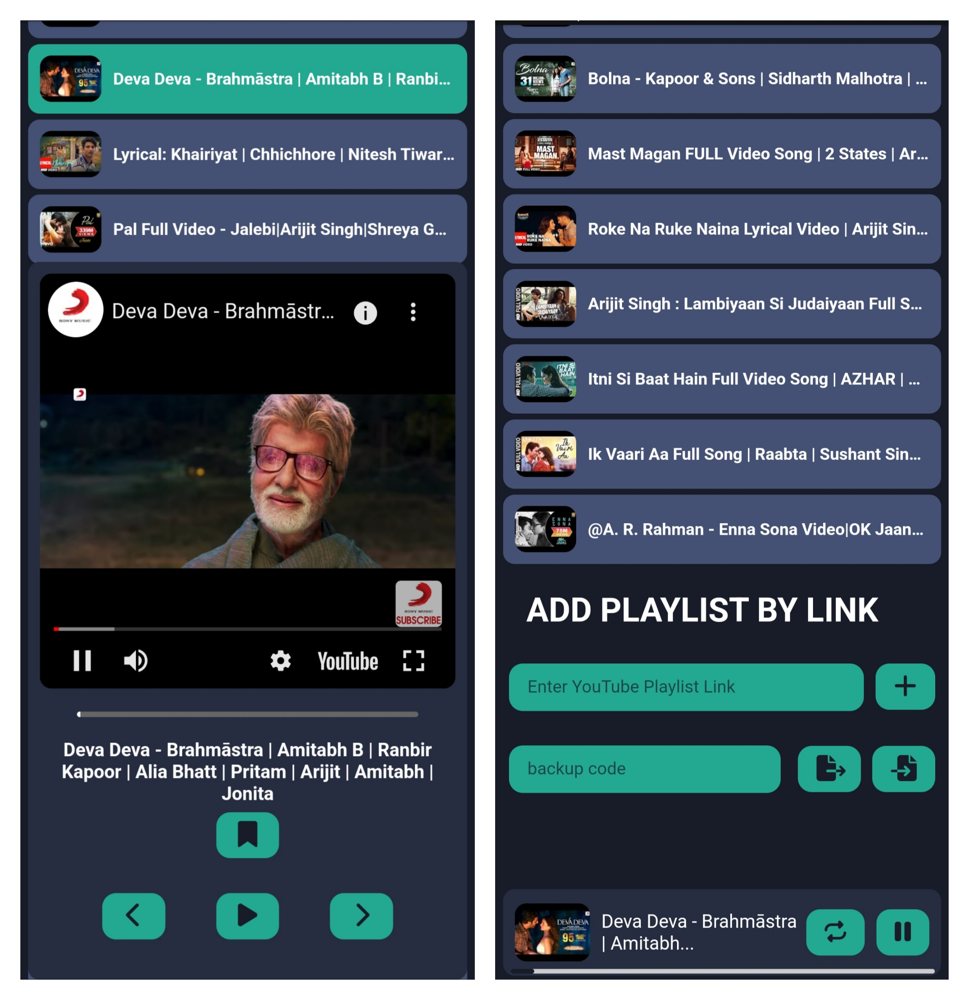

<h1 align="center">
   PHOTON PLAYER 
</h1>

  

<h1 align="center">
TAP THIS LOGO TO GO TO PHOTON PLAYER
</h1>

<h1 align="center">
   INFORMATION
</h1>
Photon Player is a minimal music player that uses the YouTube API to play music. It has basic features such as play, pause, and skip. The music player also has additional features such as save to playlist, shuffle play, add playlist by link, gesture support, and play music videos. This is my first project and I’m excited to share it with everyone 

You can go ahead and check out my website at https://shubham01015.github.io/photon_player/

<h1 align="center">
   PHOTON PLAYER PREVIEW
</h1>

  

<h1 align="center">
   PHOTON PLAYER FEATURE
</h1>

| Feature                |     |
| ---------------------- | --- |
| User Accounts          | ✅ |
| play,pause button      | ✅ |
| Shuffle play button    | ✅ |
| Playlist Bookmarks     | ✅ |
| Youtube song Search    | ✅ |
| Video Player           | ✅ |
| Add youtube playlist   | ✅ |
| Backup playlist        | ✅ |
| Background play        | ✅ |
| Discovery section      | ✅ |
| Trending section       | ✅ |

<h1 align="center">
  CONTACT INTO
</h1>

  

